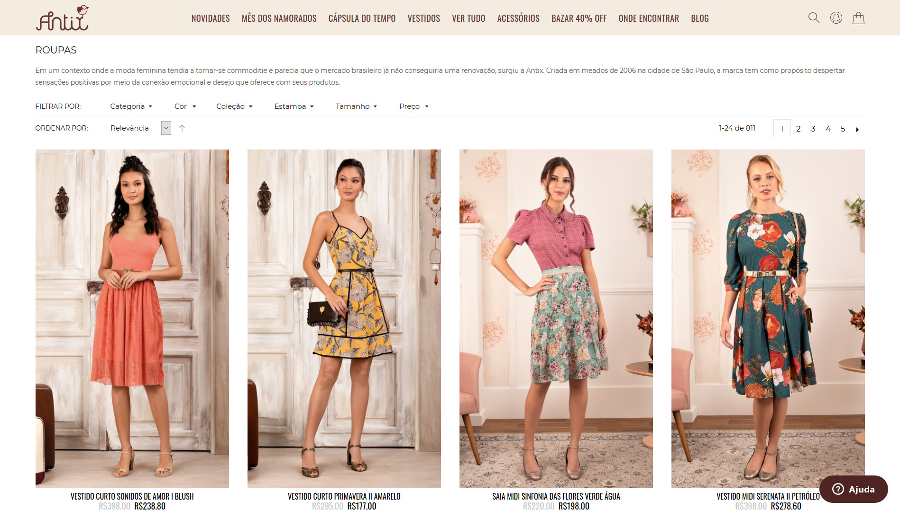

<h3 align="center">
    
   

## 🌸 Sobre o projeto

Projeto apresentado para a disciplina de programação web no segundo semestre de 2019.
Consta na replicação da **primeira vista** de um layout de um **site estático**, utilizando apenas as tecnologias HTML e CSS. Deverá ser responsivo e com portabilidade entre navegadores.
Não será permitido a utilização de frameworks durante esta estapa.

## 💻 Tecnologias utilizadas
As seguintes ferramentas foram usadas na construção do projeto:
- HTML
- CSS

## Site escolhido
https://www.amoantix.com/todos-os-produtos/roupas  
**em setembro de 2019** 

 
**print tirado em 2020** 

_atualizando o README em 2020. Teve algumas pequenas mudanças por conta de promoções e por ter mudado a coleção, mas o site continua com o mesmo layout (na época não tirei o print)_

