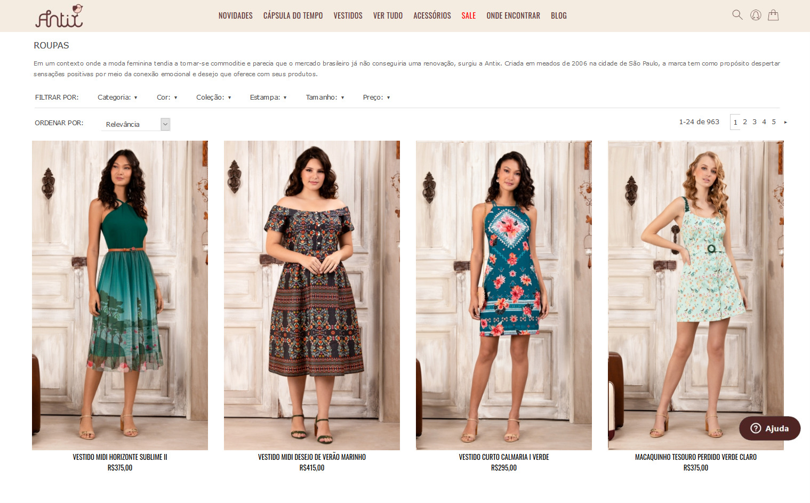

## 🌸 Sobre o projeto

Projeto apresentado para a disciplina de programação web no segundo semestre de 2019.
Consta na replicação da **primeira vista** de um layout de um **site estático**, utilizando apenas as tecnologias HTML e CSS. Deverá ser responsivo e com portabilidade entre navegadores.
Não será permitido a utilização de frameworks durante esta estapa.

## 💻 Tecnologias utilizadas
As seguintes ferramentas foram usadas na construção do projeto:
- HTML
- CSS

## Resultado

Primeira vista do site original:

[Site original](https://www.amoantix.com/todos-os-produtos/roupas)

Resultado do projeto:

[Projeto](https://rafaoliveir.github.io/Projeto1Web/)

